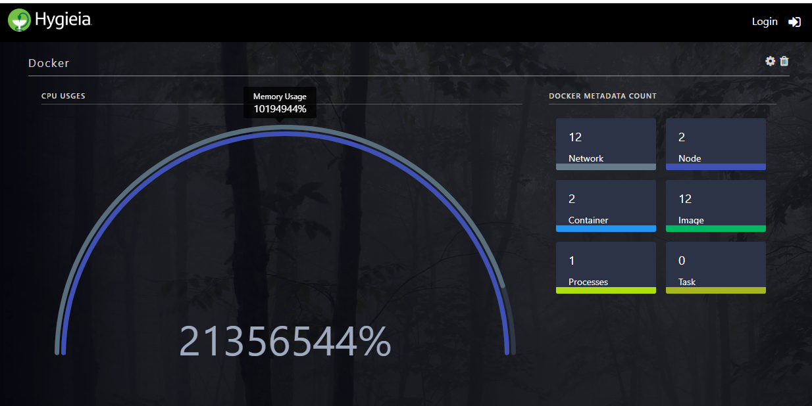
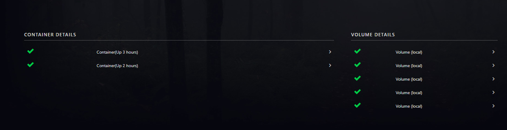
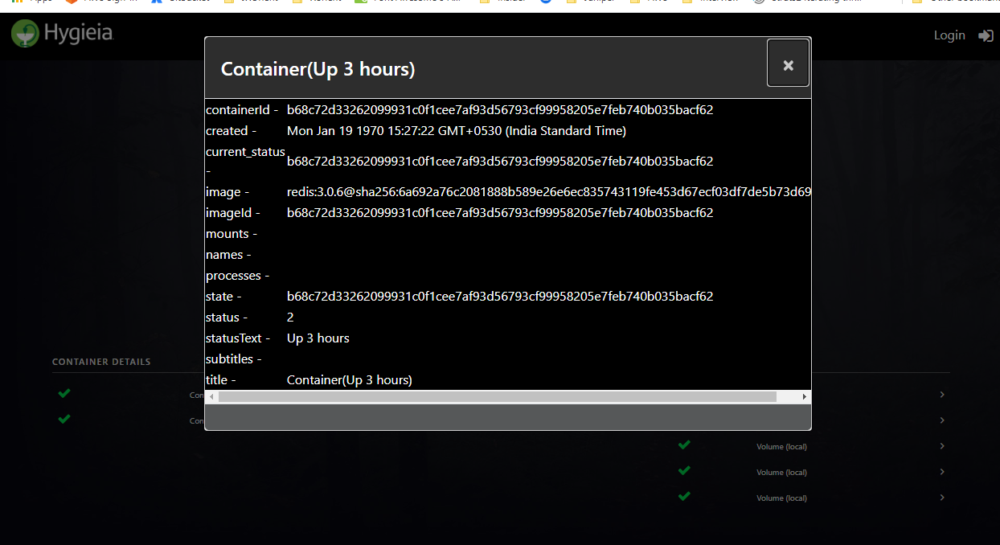
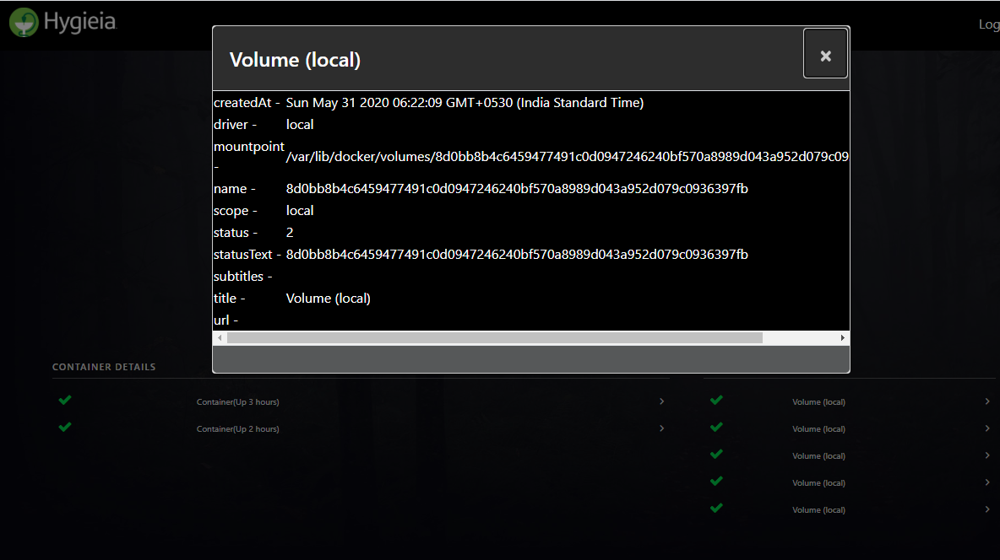
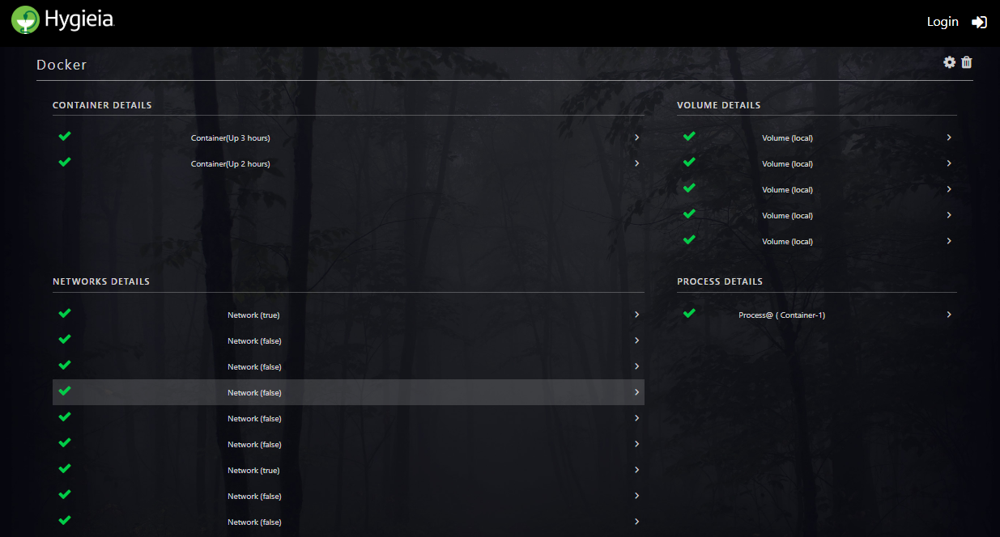

<h3>A collector to showcase the Docker Container details</h3>
https://docs.docker.com/engine/api/v1.24/

<h3>How is Docker App Organized?</h3>
 Each Docker app has Daemon
  The Daemon facillitates the API
  Down end the APIS are given.

<h3>Technical Description</h3>
  The Classes and the description
  Docker Controller: To expose the api calls made from UI to get the Component Data
  DockerCollectorTask : As with the framework , implemeting Collector Task to regulary collect the details from Docker container  and feed into the MongoDb
  DockerServiceImpl: To populate the componentData mdel and send back to UI
  
  <h3>To build docker & mounting the application.properties while docker build</h3>
  docker run -t -i -p port-internal:port-external -v properties_location://hygieia/config  image_name

To find the by CollectorId in Collector Items
db.getCollection('collector_items').find({"collectorId" : ObjectId("5eddd00ddfdae82a2cd6254f")})

<h3> Docker Hub</h3>
https://hub.docker.com/search?q=hello&type=image

docker network create -d bridge my-bridge-network

docker create -v /data --name data ubuntu

http://3.15.18.4:5555/v1.24/containers/json

[{"Id":"3142cca77641d75d4c5629e6cf4c6503a19e65cd791e67e725f2ecfdb7a872ce","Names":["/redis.1.6qgb0pna6iphr7c4ijzuiihaa"],"Image":"redis:3.0.6@sha256:6a692a76c2081888b589e26e6ec835743119fe453d67ecf03df7de5b73d69842","ImageID":"sha256:d4deec2c521cdae0450218bd53c69611bacd2eb10838057a5de7dcb341c66cf5","Command":"/entrypoint.sh redis-server","Created":1590906089,"Ports":[{"PrivatePort":6379,"Type":"tcp"}],"Labels":{"com.docker.swarm.node.id":"9opfw0jjrrkehjh5mjo34ov36","com.docker.swarm.service.id":"iws2t1vxpyb6khuq6n5ygn2xf","com.docker.swarm.service.name":"redis","com.docker.swarm.task":"","com.docker.swarm.task.id":"6qgb0pna6iphr7c4ijzuiihaa","com.docker.swarm.task.name":"redis.1.6qgb0pna6iphr7c4ijzuiihaa"},"State":"running","Status":"Up 4 minutes","HostConfig":{"NetworkMode":"default"},"NetworkSettings":{"Networks":{"bridge":{"IPAMConfig":null,"Links":null,"Aliases":null,"NetworkID":"1c38bcc4cd8e861058deae9a0fdf98b73d53fb33b92e6af7a49131fd40787108","EndpointID":"823985f3185ed8f5530bfb739d80b1a70e6ef6589488101d7390801323973097","Gateway":"172.17.0.1","IPAddress":"172.17.0.2","IPPrefixLen":16,"IPv6Gateway":"","GlobalIPv6Address":"","GlobalIPv6PrefixLen":0,"MacAddress":"02:42:ac:11:00:02","DriverOpts":null}}},"Mounts":[{"Type":"volume","Name":"23ae51a5bbd4e5237fb4d5c57ebbb3175fe571b19300eaf171a24e3fa7b587aa","Source":"","Destination":"/data","Driver":"local","Mode":"","RW":true,"Propagation":""}]}]

http://3.15.18.4:5555/v1.24/tasks

[{"ID":"6qgb0pna6iphr7c4ijzuiihaa","Version":{"Index":17},"CreatedAt":"2020-05-31T06:21:21.9356773Z","UpdatedAt":"2020-05-31T06:21:30.2943931Z","Labels":{},"Spec":{"ContainerSpec":{"Image":"redis:3.0.6@sha256:6a692a76c2081888b589e26e6ec835743119fe453d67ecf03df7de5b73d69842","Init":false,"DNSConfig":{},"Isolation":"default"},"Resources":{"Limits":{},"Reservations":{}},"Placement":{"Platforms":[{"Architecture":"amd64","OS":"linux"}]},"ForceUpdate":0},"ServiceID":"iws2t1vxpyb6khuq6n5ygn2xf","Slot":1,"NodeID":"9opfw0jjrrkehjh5mjo34ov36","Status":{"Timestamp":"2020-05-31T06:21:30.271778552Z","State":"running","Message":"started","ContainerStatus":{"ContainerID":"3142cca77641d75d4c5629e6cf4c6503a19e65cd791e67e725f2ecfdb7a872ce","PID":9610,"ExitCode":0},"PortStatus":{}},"DesiredState":"running"}]

http://3.15.18.4:5555/v1.24/volumes

{"Volumes":[{"CreatedAt":"2020-05-31T06:21:30Z","Driver":"local","Labels":null,"Mountpoint":"/var/lib/docker/volumes/23ae51a5bbd4e5237fb4d5c57ebbb3175fe571b19300eaf171a24e3fa7b587aa/_data","Name":"23ae51a5bbd4e5237fb4d5c57ebbb3175fe571b19300eaf171a24e3fa7b587aa","Options":null,"Scope":"local"},{"CreatedAt":"2020-05-31T06:22:09Z","Driver":"local","Labels":null,"Mountpoint":"/var/lib/docker/volumes/8d0bb8b4c6459477491c0d0947246240bf570a8989d043a952d079c0936397fb/_data","Name":"8d0bb8b4c6459477491c0d0947246240bf570a8989d043a952d079c0936397fb","Options":null,"Scope":"local"}],"Warnings":null}

http://3.15.18.4:5555/v1.24/networks

[{"Name":"ingress","Id":"d4a14ksm3py8bcc1lvz27vnkc","Created":"2020-05-31T06:20:10.868891918Z","Scope":"swarm","Driver":"overlay","EnableIPv6":false,"IPAM":{"Driver":"default","Options":null,"Config":[{"Subnet":"10.0.0.0/24","Gateway":"10.0.0.1"}]},"Internal":false,"Attachable":false,"Ingress":true,"ConfigFrom":{"Network":""},"ConfigOnly":false,"Containers":null,"Options":{"com.docker.network.driver.overlay.vxlanid_list":"4096"},"Labels":null},{"Name":"docker_gwbridge","Id":"91fe4a50fce33ed251b3c4f724bcd1157ad11f6719a294439fd383b0d4d0283c","Created":"2020-05-31T06:20:12.429548119Z","Scope":"local","Driver":"bridge","EnableIPv6":false,"IPAM":{"Driver":"default","Options":null,"Config":[{"Subnet":"172.19.0.0/16","Gateway":"172.19.0.1"}]},"Internal":false,"Attachable":false,"Ingress":false,"ConfigFrom":{"Network":""},"ConfigOnly":false,"Containers":{"ingress-sbox":{"Name":"gateway_ingress-sbox","EndpointID":"d58a3742d0bc1980b75e7faa2a30ba69aaf426b93354d5ad6d184f81104ecb5a","MacAddress":"02:42:ac:13:00:02","IPv4Address":"172.19.0.2/16","IPv6Address":""}},"Options":{"com.docker.network.bridge.enable_icc":"false","com.docker.network.bridge.enable_ip_masquerade":"true","com.docker.network.bridge.name":"docker_gwbridge"},"Labels":{}},{"Name":"bridge","Id":"1c38bcc4cd8e861058deae9a0fdf98b73d53fb33b92e6af7a49131fd40787108","Created":"2020-05-31T06:14:15.919812507Z","Scope":"local","Driver":"bridge","EnableIPv6":false,"IPAM":{"Driver":"default","Options":null,"Config":[{"Subnet":"172.17.0.0/16","Gateway":"172.17.0.1"}]},"Internal":false,"Attachable":false,"Ingress":false,"ConfigFrom":{"Network":""},"ConfigOnly":false,"Containers":{"3142cca77641d75d4c5629e6cf4c6503a19e65cd791e67e725f2ecfdb7a872ce":{"Name":"redis.1.6qgb0pna6iphr7c4ijzuiihaa","EndpointID":"823985f3185ed8f5530bfb739d80b1a70e6ef6589488101d7390801323973097","MacAddress":"02:42:ac:11:00:02","IPv4Address":"172.17.0.2/16","IPv6Address":""}},"Options":{"com.docker.network.bridge.default_bridge":"true","com.docker.network.bridge.enable_icc":"true","com.docker.network.bridge.enable_ip_masquerade":"true","com.docker.network.bridge.host_binding_ipv4":"0.0.0.0","com.docker.network.bridge.name":"docker0","com.docker.network.driver.mtu":"1500"},"Labels":{}},{"Name":"none","Id":"89f233338b7555961c86bb0800eac0beeeac1ba27369ce1f426972525f2621be","Created":"2020-05-20T13:01:10.594788222Z","Scope":"local","Driver":"null","EnableIPv6":false,"IPAM":{"Driver":"default","Options":null,"Config":[]},"Internal":false,"Attachable":false,"Ingress":false,"ConfigFrom":{"Network":""},"ConfigOnly":false,"Containers":{},"Options":{},"Labels":{}},{"Name":"host","Id":"b29011dbd9b37a0d1722fb3f2d9f81ba28cdb6314a33d285f6b2a56ce025122e","Created":"2020-05-20T13:01:10.606717346Z","Scope":"local","Driver":"host","EnableIPv6":false,"IPAM":{"Driver":"default","Options":null,"Config":[]},"Internal":false,"Attachable":false,"Ingress":false,"ConfigFrom":{"Network":""},"ConfigOnly":false,"Containers":{},"Options":{},"Labels":{}},{"Name":"my-bridge-network","Id":"f24bc896ba9f0611d1791200b4b498e8c40b27bd6d6518c80003eab9064d3d8b","Created":"2020-05-31T06:17:57.756597152Z","Scope":"local","Driver":"bridge","EnableIPv6":false,"IPAM":{"Driver":"default","Options":{},"Config":[{"Subnet":"172.18.0.0/16","Gateway":"172.18.0.1"}]},"Internal":false,"Attachable":false,"Ingress":false,"ConfigFrom":{"Network":""},"ConfigOnly":false,"Containers":{},"Options":{},"Labels":{}}]

http://3.15.18.4:5555/v1.24/nodes

[{"ID":"9opfw0jjrrkehjh5mjo34ov36","Version":{"Index":9},"CreatedAt":"2020-05-31T06:20:10.868734481Z","UpdatedAt":"2020-05-31T06:20:11.476494206Z","Spec":{"Labels":{},"Role":"manager","Availability":"active"},"Description":{"Hostname":"ip-172-31-4-164","Platform":{"Architecture":"x86_64","OS":"linux"},"Resources":{"NanoCPUs":2000000000,"MemoryBytes":480374784},"Engine":{"EngineVersion":"19.03.9","Plugins":[{"Type":"Log","Name":"awslogs"},{"Type":"Log","Name":"fluentd"},{"Type":"Log","Name":"gcplogs"},{"Type":"Log","Name":"gelf"},{"Type":"Log","Name":"journald"},{"Type":"Log","Name":"json-file"},{"Type":"Log","Name":"local"},{"Type":"Log","Name":"logentries"},{"Type":"Log","Name":"splunk"},{"Type":"Log","Name":"syslog"},{"Type":"Network","Name":"bridge"},{"Type":"Network","Name":"host"},{"Type":"Network","Name":"ipvlan"},{"Type":"Network","Name":"macvlan"},{"Type":"Network","Name":"null"},{"Type":"Network","Name":"overlay"},{"Type":"Volume","Name":"local"}]},"TLSInfo":{"TrustRoot":"-----BEGIN CERTIFICATE-----\nMIIBaTCCARCgAwIBAgIUXoMMj1D5FvbEnIaRpX3GWgZps4EwCgYIKoZIzj0EAwIw\nEzERMA8GA1UEAxMIc3dhcm0tY2EwHhcNMjAwNTMxMDYxNTAwWhcNNDAwNTI2MDYx\nNTAwWjATMREwDwYDVQQDEwhzd2FybS1jYTBZMBMGByqGSM49AgEGCCqGSM49AwEH\nA0IABIkizbGFaTWsbfCnRSD4vK1geAHGNZOM6wtuHssyuBUuem4qi1pAnAMUTwsk\nklbteOoIgd3gS+Ve3KYuKGhf41ijQjBAMA4GA1UdDwEB/wQEAwIBBjAPBgNVHRMB\nAf8EBTADAQH/MB0GA1UdDgQWBBRw3AMHF1GzCjNdBoISIfrdTbGsCzAKBggqhkjO\nPQQDAgNHADBEAiBTQ7ZX+WxE9Khq8oBNv4KobXLdBkWN7Slsa9WaUcu3DAIgd8cc\nl4f9aW+LZM9O7fipDNckH17jnuPc0TyJ3okFIuc=\n-----END CERTIFICATE-----\n","CertIssuerSubject":"MBMxETAPBgNVBAMTCHN3YXJtLWNh","CertIssuerPublicKey":"MFkwEwYHKoZIzj0CAQYIKoZIzj0DAQcDQgAEiSLNsYVpNaxt8KdFIPi8rWB4AcY1k4zrC24eyzK4FS56biqLWkCcAxRPCySSVu146giB3eBL5V7cpi4oaF/jWA=="}},"Status":{"State":"ready","Addr":"172.31.4.164"},"ManagerStatus":{"Leader":true,"Reachability":"reachable","Addr":"172.31.4.164:2377"}}]

http://3.15.18.4:5555/v1.24/containers/3142cca77641d75d4c5629e6cf4c6503a19e65cd791e67e725f2ecfdb7a872ce/top

{"Processes":[["999","9610","9580","0","06:21","?","00:00:06","redis-server *:6379"]],"Titles":["UID","PID","PPID","C","STIME","TTY","TIME","CMD"]}

https://docs.docker.com/engine/api/v1.21/

